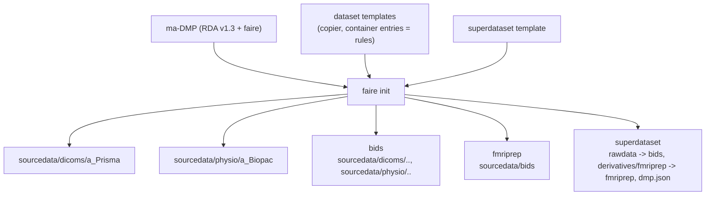
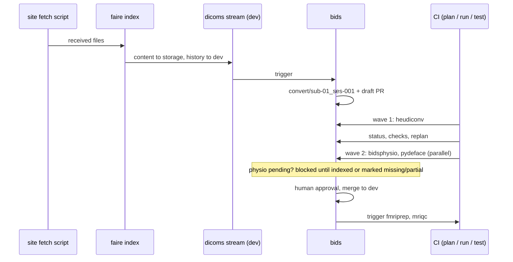
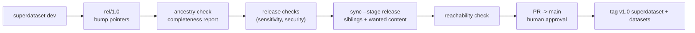

# Diagrams

Illustrative companion to `design.md`; the specs are normative.

## 1. From ma-DMP to repositories

```mermaid
flowchart TB
  DMP["ma-DMP (RDA v1.3 + faire)"] --> INIT["faire init"]
  TPL["dataset templates<br/>(copier, container entries = rules)"] --> INIT
  STPL["superdataset template"] --> INIT
  INIT --> S1["sourcedata/dicoms/a_Prisma"]
  INIT --> S2["sourcedata/physio/a_Biopac"]
  INIT --> B["bids<br/>sourcedata/dicoms/.., sourcedata/physio/.."]
  INIT --> F["fmriprep<br/>sourcedata/bids"]
  INIT --> SUP["superdataset<br/>rawdata -> bids, derivatives/fmriprep -> fmriprep, dmp.json"]
```

## 2. One session

```mermaid
sequenceDiagram
  participant Site as site fetch script
  participant Idx as faire index
  participant Str as dicoms stream (dev)
  participant B as bids
  participant CI as CI (plan / run / test)
  Site->>Idx: received files
  Idx->>Str: content to storage, history to dev
  Str->>B: trigger
  B->>B: convert/sub-01_ses-001 + draft PR
  CI->>B: wave 1: heudiconv
  CI->>B: status, checks, replan
  CI->>B: wave 2: bidsphysio, pydeface (parallel)
  Note over B: physio pending? blocked until indexed or marked missing/partial
  B->>B: human approval, merge to dev
  B->>CI: trigger fmriprep, mriqc
```

## 3. Release

```mermaid
flowchart LR
  DEV["superdataset dev"] --> REL["rel/1.0<br/>bump pointers"]
  REL --> C1["ancestry check<br/>completeness report"]
  C1 --> C2["release checks<br/>(sensitivity, security)"]
  C2 --> SY["sync --stage release<br/>siblings + wanted content"]
  SY --> C3["reachability check"]
  C3 --> PR["PR -> main<br/>human approval"]
  PR --> TAG["tag v1.0 superdataset + datasets"]
```
